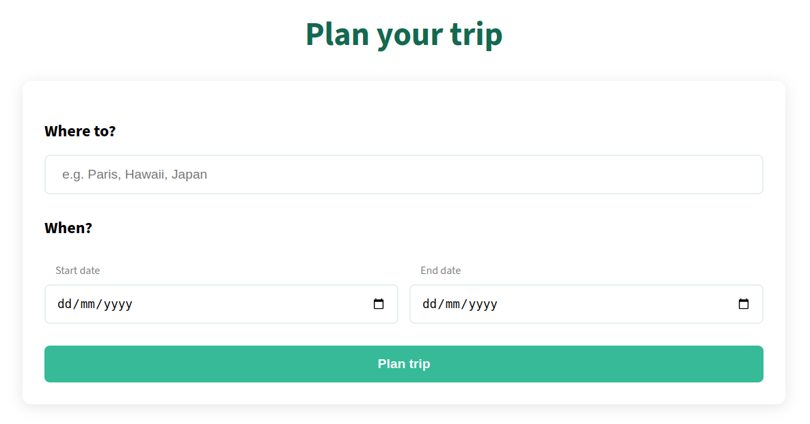
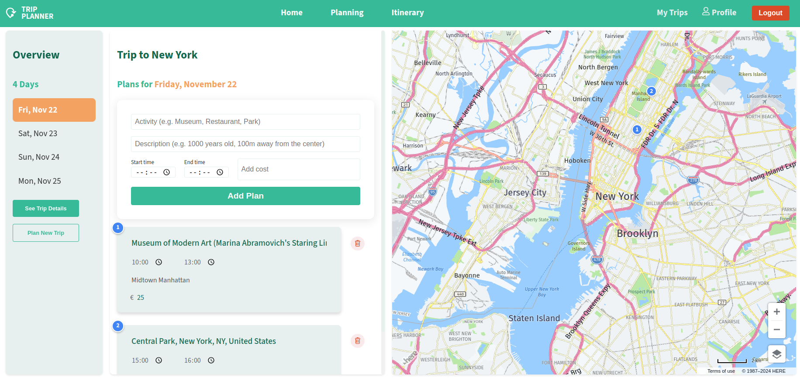
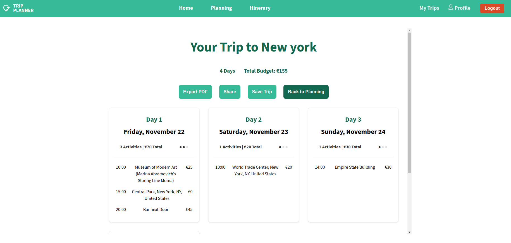
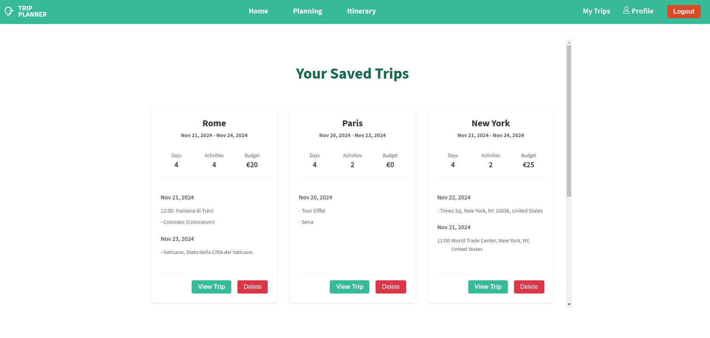

# TripPlanner 🌍 A Travel Itinerary Web Application

TripPlanner helps you create detailed travel plans with interactive maps, activity scheduling, and budget tracking.

 

🔗 [Live Demo - Try it now!](https://trip-planner-lovat-seven.vercel.app)

## Table of Contents

- [Introduction](#introduction)
- [Key Features](#key-features)
- [Tech Stack](#tech-stack)
- [Project Structure](#project-structure)
- [Acknowledgments](#acknowledgments)
- [Preview](#preview)

## Introduction

TripPlanner is a comprehensive travel planning application that combines interactive mapping, detailed activity scheduling, and budget management.

I created TripPlanner as both a learning experience and a practical solution for my own travel planning needs. This project allowed me to dive deep into React development, work with external APIs, and implement user authentication while building something I would actually use.

TripPlanner is designed for **desktop use only**. For the best experience, please access the application on a desktop browser.

#### TripPlanner in a nutshell:

- 📍 Interactive map integration with HERE Maps API
- 📅 Day-by-day activity planning
- 💰 Budget tracking for each activity
- 🔄 Real-time updates and synchronization
- 🔐 Secure user authentication

## Key Features

#### 1. Interactive Trip Planning

- Destination search with HERE Maps API autocomplete
- Interactive map with location markers
- Day-by-day itinerary planning

#### 2. Activity Management

- Add, edit, and remove activities
- Set start and end times
- Add activity descriptions
- Track costs per activity
- Automatic budget calculation

#### 3. Map Integration

- Interactive HERE Maps integration
- Location search and suggestions
- Visual representation of planned activities
- Custom markers for each activity

#### 4. User Management

- Secure authentication system using Firebase
- Personal dashboard
- Save and manage multiple trips
- Simple profile customization

#### 5. Data Export & Sharing

- Export itineraries to PDF
- Simple sharing of trip content with others

#### 6. State Management

- React Context API for global state
- Custom reducers for predictable state updates
- Real-time synchronization with Firestore
- Local storage for guest users

 

**Note:** The contact email shown in the footer of my application is not real and is included for demonstration purposes only.

## Tech Stack

#### Frontend

- React 18
- Context API for state management
- React Router for navigation
- HTML5 & CSS3
- JavaScript ES6+

#### Backend & Services

- Firebase Authentication
- Firebase Firestore
- HERE Maps API
- Vite build tool
- Vercel for deployment

#### Additional Tools

- Axios for API requests
- html2pdf for PDF generation
- Custom utility functions
- Environment variable management

## Project Structure

src/  
├── components/  
│ ├── activity/ # Activity-related components  
│ ├── auth/ # Authentication components  
│ └── layout/ # Layout components  
├── contexts/ # React Context providers  
├── pages/ # Main application pages  
├── reducers/ # State management reducers  
├── styles/ # CSS stylesheets  
├── utils/ # Utility functions  
└── config/ # Configuration files

## Acknowledgments

A big thanks to [Wanderlog](https://wanderlog.com) for inspiring the design and functionality of this application. Their outstanding platform provided valuable insights that shaped my approach to building my TripPlanner.

## Preview

#### Planning Page

#### Itinerary Page

#### Saved Trips Page

 

---

Made with ❤️ by [Cátia Monteiro](https://github.com/diecatiamonteiro). Thanks for reading!
